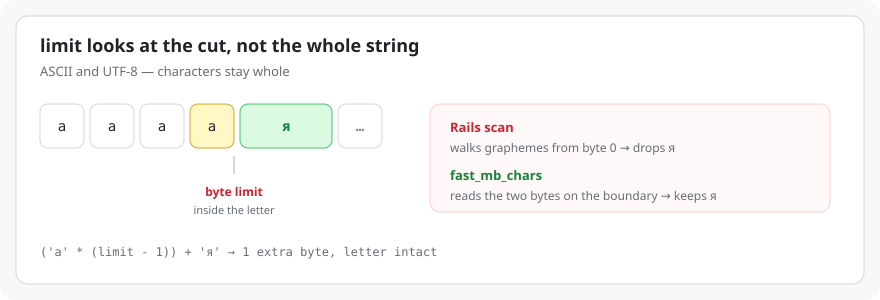
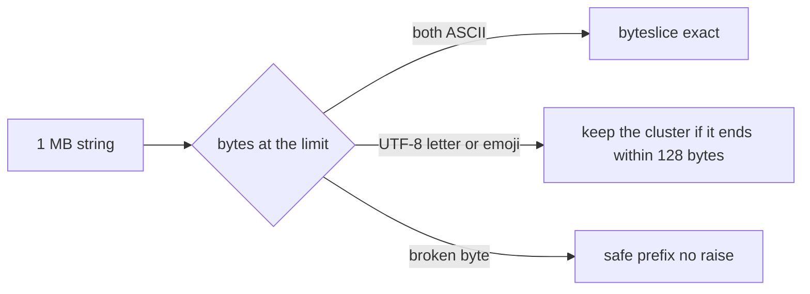

# ⚡ fast_mb_chars

Faster `String#mb_chars` for Ruby. Same calls as `ActiveSupport::Multibyte::Chars` — `limit`, `downcase`, `upcase`, `titleize`, `reverse`, `split`, `tidy_bytes`. The byte cut does not split a character and does not raise on a broken byte.

Works on **ASCII** and **UTF-8** (Київ, café, 日本語, emoji). Other encodings need a convert first.

<p align="center">
  
</p>

`mb_chars.limit` in Rails reads every character from the start of the string. This gem looks at the cut. On a 1 MB string that is **205 ms** vs **0.08 ms**.

| | 1 MB | 7 MB |
| --- | ---: | ---: |
| ActiveSupport-style scan | 205 ms | 1,410 ms |
| **fast_mb_chars** | **0.08 ms** | **0.47 ms** |
| | **~2,500×** | **~3,000×** |

ASCII, Ruby 4.0.5, one call. The string is longer than the limit, so both sides actually cut. Full tables are [below](#-benchmarks).

[](https://github.com/SYNORYXEL/fast_mb_chars/actions)
[](https://rubygems.org/gems/fast_mb_chars)
[](https://www.ruby-lang.org/)
[](LICENSE)
[](#-encodings)

Source: [github.com/SYNORYXEL/fast_mb_chars](https://github.com/SYNORYXEL/fast_mb_chars)

## 🌍 Encodings

The gem treats the string as **UTF-8 bytes**. ASCII is UTF-8. It is not a transcoding library.

| Input | What happens |
| --- | --- |
| ASCII `hello` | Fast path. Both bytes on the boundary are `< 0x80`, so the cut is exact. |
| UTF-8 `Київ`, `café`, `日本語`, `👨‍👩‍👧‍👦` | Yes. A letter or emoji that crosses the limit stays whole. |
| Broken / binary bytes | No `ArgumentError`. Invalid sequences are skipped or scrubbed. |
| Windows-1252 mixed into UTF-8 (`caf\xE9`) | `tidy_bytes` repairs it to `café`. |
| Windows-1251, KOI8-R, ISO-8859-1, Shift_JIS, UTF-16 | **No.** Bytes are relabeled as UTF-8, not converted. Encode first. |

```ruby
# already UTF-8 or ASCII — just call it
'Київ'.mb_chars.downcase.to_s
'hello'.mb_chars.limit(4).to_s

# other encodings: convert, then cut
cp1251.encode('UTF-8').mb_chars.limit(1_048_576).to_s
```

`force_encoding('UTF-8')` only changes the label. `encode('UTF-8')` changes the bytes. Use the second one when the source is not UTF-8.

## 📦 Install

Ruby 2.7 or newer. Tests run on 4.0.5. CI runs 2.7, 3.2, 3.3, 3.4, and 4.0.

```ruby
gem 'fast_mb_chars'
```

```ruby
require 'fast_mb_chars'
```

Or `gem install fast_mb_chars`. The gem prepends `String#mb_chars`, so existing `'text'.mb_chars.downcase` calls in a Rails app keep working. It does not patch `String#downcase`. If another library prepends `mb_chars` later, call `FastMbChars.install!` again. No runtime dependencies.

From a checkout: `gem build fast_mb_chars.gemspec` then `gem install ./fast_mb_chars-0.1.0.gem`. Next to an app, `gem 'fast_mb_chars', path: '../fast_mb_chars'` works too.

## ✨ Usage

```ruby
'ГОТІВКА'.mb_chars.downcase.to_s
# => "готівка"

'  Київ  '.mb_chars.downcase.strip.to_s
# => "київ"

'ÉL QUE SE ENTERÓ'.mb_chars.titleize.to_s
# => "Él Que Se Enteró"

'Café périferôl'.mb_chars.split(/é/).map { |part| part.upcase.to_s }
# => ["CAF", " P", "RIFERÔL"]

data.mb_chars.limit(1_048_576).to_s
data.mb_chars.limit(7_340_032).to_s
```

Methods on the proxy itself: `limit`, `reverse`, `reverse!`, `titleize`, `titlecase`, `compose`, `decompose`, `grapheme_length`, `tidy_bytes`, `tidy_bytes!`, `split`, `slice!`, `<=>`, `=~`, `match?`, `acts_like_string?`, `as_json`, `to_s`, `to_str`.

`downcase`, `upcase`, `capitalize`, `swapcase`, `strip`, `gsub`, `length`, and the rest of `String` go through `method_missing`. A string result comes back as `mb_chars`, so the chain does not break. A bang method that changes the string returns the same proxy; if Ruby returns `nil` (no change), this does too.

`titleize` is a Unicode-aware regex, not ActiveSupport inflections.

## 🚀 Why it is faster

Rails does this:

```ruby
def limit(limit)
  chars(@wrapped_string.truncate_bytes(limit, omission: nil))
end
```

`truncate_bytes` walks graphemes from byte 0 until it hits the limit. That is fine for a button label. It is not fine for a 1 MB or 7 MB log line.

`fast_mb_chars` reads the two bytes on the boundary.

- Both ASCII, and not a CR+LF pair: one `byteslice`. Exact.
- A character crosses the limit and ends within 128 bytes: keep it whole. The result can be a few bytes over the limit.
- A long run of combining marks that does not fit in those 128 bytes: drop it. The result stays within the limit.
- Empty string, or a limit of 0 or less: `""`.
- Shorter than the limit: returned as-is, trailing spaces and punctuation included.
- A broken byte never reaches a regexp, so there is no `ArgumentError`.

Rails never goes past the limit, so it drops the character on the boundary. This gem keeps a short character. That is the one behavioral difference, and it is why a cut like `('a' * (limit - 1)) + 'я'` comes back one byte longer, with `я` intact.



## 📊 Benchmarks

"scan" walks graphemes from the start, which is what `mb_chars.limit` does. "fast" is `FastMbChars::Limiter.limit`. Milliseconds per call, Ruby 4.0.5.

### ASCII

The cut lands on a byte. Both results are exactly the limit.

| size | scan | fast | times |
| --- | ---: | ---: | ---: |
| 1 KB | 0.198 | 0.000 | 499× |
| 8 KB | 1.566 | 0.001 | 1,284× |
| 64 KB | 12.671 | 0.010 | 1,233× |
| 256 KB | 50.936 | 0.028 | 1,841× |
| 1 MB | 205.382 | 0.083 | 2,467× |
| 7 MB | 1,409.907 | 0.466 | 3,028× |

### Cyrillic

The cut lands between letters. Both results are exactly the limit.

| size | scan | fast | times |
| --- | ---: | ---: | ---: |
| 1 KB | 0.145 | 0.020 | 7× |
| 8 KB | 1.145 | 0.022 | 52× |
| 64 KB | 9.282 | 0.023 | 407× |
| 256 KB | 36.863 | 0.040 | 931× |
| 1 MB | 147.932 | 0.068 | 2,164× |
| 7 MB | 1,032.553 | 0.194 | 5,322× |

### Character on the boundary

`я` crosses the limit. The scan stops on the limit and drops the letter. The fast cut keeps it, so the result is one byte over.

| size | scan | fast | times | fast bytes / limit |
| --- | ---: | ---: | ---: | ---: |
| 1 KB | 0.196 | 0.027 | 7× | 1025 / 1024 |
| 8 KB | 1.545 | 0.029 | 54× | 8193 / 8192 |
| 64 KB | 12.377 | 0.028 | 443× | 65537 / 65536 |
| 256 KB | 49.862 | 0.026 | 1,893× | 262145 / 262144 |
| 1 MB | 199.377 | 0.036 | 5,597× | 1048577 / 1048576 |
| 7 MB | 1,479.463 | 0.030 | 49,870× | 7340033 / 7340032 |

On a short string you pay for the wrapper, not for the cut. `'ГОТІВКА'.mb_chars.downcase.to_s` was 0.0006 ms. `String#downcase` was 0.0002 ms.

```bash
ruby benchmark/compare.rb
```

## ✅ Tests

```bash
bundle exec rake
```

## 💡 Improvements

This gem is new. If something would make it more useful in your app — a missing method, a Rails edge case, a faster path, docs — please [open an issue](https://github.com/SYNORYXEL/fast_mb_chars/issues) or a pull request. Suggestions are welcome.

## 📄 License

MIT. See [LICENSE](LICENSE).
